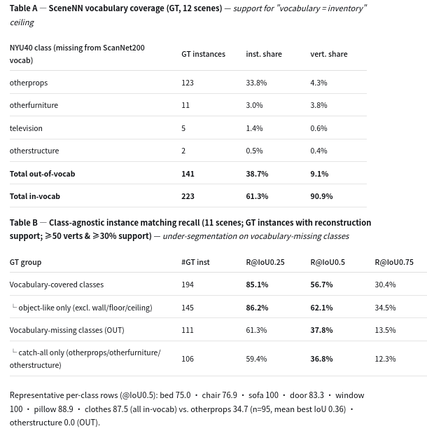
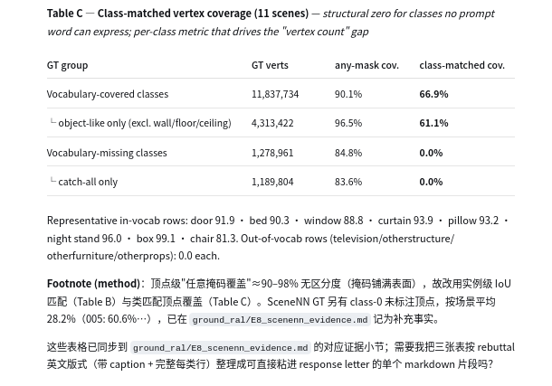

一、主实验清单（实验 → 回应哪条意见 → 状态）
P0 —— 审稿人点名、直接影响接收（必跑）

查看端口状态: netstat -tunlp | grep 18090
#	实验	回应	状态/工作量
E1	2×2 消融（SAM3/CropFormer × label-bound/per-crop，全量）	R1"component swap"；R2"label binding 与常见做法差异"	✅ 代码已就绪（ablation-clean 分支 --arm A/B + compare_ablation.py），待全量跑
####################################################################################################################################
建立通道
ssh -fN -4 -o ServerAliveInterval=30 -o ServerAliveCountMax=6 \
  -L 127.0.0.1:18090:localhost:8090 -p 8972 root@10.21.15.113

113:
/root/anaconda3/envs/sam3/bin/python -m uvicorn sam3_service_1:app --host 0.0.0.0 --port 8090

消融:
cd /home/OnlineAnySeg

cd /home/OnlineAnySeg

# A 臂：SAM3 + label-bound 文本（自动: --feature-source text + scannet_test_1024.yaml + output_ral/A）
python main_eval_scannet.py --arm A \
  --scans-root /home/OnlineAnySeg/data_eval/scannet --device cuda:1 --merge-gpu 1
  AP     AP25    AP50
21.81	  39.26    60.15

# B 臂：SAM3 + per-crop CLIP（自动: --feature-source crop + scannet_test_1024.yaml + output_ral/B）
python main_eval_scannet.py --arm B \
  --scans-root /home/OnlineAnySeg/data_eval/scannet --device cuda:0 --merge-gpu 0
  AP     AP25    AP50    
20.05	  37.36	   58.66

# C 臂: CropFormer+crop = 原论文 OnlineAnySeg
  AP    AP25   AP50
 18.6 / 36.1 / 53.5

# D 臂运行命令（CropFormer + label-bound text）
cd /home/OnlineAnySeg

export PYTHONPATH=/home/OnlineAnySeg

/root/anaconda3/envs/OASeg/bin/python archive/main_crop.py \
  --config ./config/scannet_test.yaml \
  --scans-root /home/OnlineAnySeg/data_eval/scannet \
  --output_dir output_ral/D \
  --feature-mode text \
  --mask-gpu 1 --merge-gpu 1 
  AP        AP50      AP25
0.2182     0.3982   0.5788

# ── 评估（分割 AP 对比，读 ckpt_final.npz + final.ply）
/root/anaconda3/envs/OASeg/bin/python scripts/compare_ablation.py \
  --result_dirs output_ral/D output_ral/B output_ral/A \
  --gt_dir /home/OnlineAnySeg/data_eval/scannet

#################################################################################################################################
E2	外部定位基线（至少一个零样本方法重跑在你的重建上，Block 2）	R1"无外部基线"；R2"场景图文献对比"	中：LLM-Grounder / ZSVG3D / CSVG 选一

L0 和 NS指标:

CSVG: cd /home/OnlineAnySeg/CSVG
  nr3d:
    运行命令: PER_SCENE=50 bash run_all.sh 
    结果:
      NR3D（nr3d20，PER_SCENE=50 → 3953 条，qwen-turbo 生成）
      json

      {
        "method": "CSVG",
        "processed": 1450,
        "skipped": 0,
        "mean_dist": 1.0992880786767079,
        "acc03m_pred": 0.5440199335548173,
        "acc05m_pred": 0.574750830564784,
        "acc03m_all": 0.4517241379310345,
        "acc05m_all": 0.4772413793103448,
        "coverage": 0.9627586206896551,
        "selacc_all": 0.45586206896551723,
        "selacc_covered": 0.47349570200573066,
        "error_split": {
          "not_reconstructed": 54,
          "no_prediction": 242,
          "wrong_selection": 269,
          "hallucinated": 224
        }
      }

  sr3d:
    运行命令: PER_SCENE=20 bash run_all_sr3d.sh
    结果:ground_ral/sr3d/csvg_ns_metrics_sr3d10.json
    {
      "method": "CSVG",
      "processed": 5247,
      "skipped": 0,
      "mean_dist": 1.338103873934609,
      "acc03m_pred": 0.5095930845456462,
      "acc05m_pred": 0.5197132616487455,
      "acc03m_all": 0.4606441776253097,
      "acc05m_all": 0.4697922622450924,
      "coverage": 0.9716028206594244,
      "selacc_all": 0.46369353916523726,
      "selacc_covered": 0.4772459788152217,
      "error_split": {
        "not_reconstructed": 149,
        "no_prediction": 487,
        "wrong_selection": 1074,
        "hallucinated": 1104
      }
    }

##################################################################################################################

E3	词表规模 vs FPS vs AP（10/30/50/100 词表）	R2"每帧传全词表、运行时随词表规模变化"	中：需服务端加 text_prompts 参数
113:
/root/anaconda3/envs/sam3/bin/python -m uvicorn e3_vocab_service:app --host 0.0.0.0 --port 8091

本机:
sshpass -p 1234 ssh -fN -o StrictHostKeyChecking=no \
  -o ServerAliveInterval=30 -o ServerAliveCountMax=6 \
  -L 127.0.0.1:18091:localhost:8091 -p 8972 root@10.21.15.113

curl -s -m 5 http://127.0.0.1:18091/health

cd /home/OnlineAnySeg

/root/anaconda3/envs/OASeg/bin/python e3_vocab_bench.py \
  --server http://127.0.0.1:18091 \
  --scenes scene0011_00 scene0015_00 \
  --vocabs 10,30,50,100 \
  --out ground_ral/e3_vocab_bench.json

V=  10: median   311.0 ms | FPS_eff   3.22 | peak_mem 16105.3 MB | segs ~8 | oom 0
V=  30: median   508.9 ms | FPS_eff   1.97 | peak_mem 16098.1 MB | segs ~11 | oom 0
V=  50: median   761.7 ms | FPS_eff   1.31 | peak_mem 16094.7 MB | segs ~12 | oom 0
V= 100: median  1626.6 ms | FPS_eff   0.61 | peak_mem 16083.8 MB | segs ~17 | oom 0

saved -> ground_ral/e3_vocab_bench.json

#####################################################################################################
E4	Scorer 逐个消融 + 关系覆盖分析	R2"7 个 scorer 无消融、无充分性论证"	中：--disable-scorer 开关 + 统计脚本

逐个消融:
运行命令: K=15 bash /home/OnlineAnySeg/run_scorer_ablation.sh
结果:ground_ral/nr3d/ablation/scorer_ablation.json
配置	  Acc@0.5m@pred	  Δ vs full	    MeanDist	  解读
full	    0.6224	      —	0.914	        基线
−contact	0.5612	      −6.1	          1.050	  掉最多 → 接触关系贡献最大
−dir	    0.5714	      −5.1	          1.024	  方向（left/right/front/behind）贡献大
−vert	    0.5714	      −5.1	          0.997	  垂直关系贡献大
−between	0.5816	      −4.1	          1.034	  三元之间关系贡献明确
−rank	    0.5918	      −3.1	          0.968	  比较距离（closest/farthest）有贡献
−side	    0.6020	      −2.0	          0.922	  贡献最小但仍为正
−near	    0.6735	      +5.1	          0.899	  ⚠️ 反直觉：去掉反而更好
−all 7	  0.3980	      −22.4	          1.472	  只剩 CLIP 类别匹配 → 大幅崩塌

关系覆盖分析:
##################################################################################################
= Relation coverage (sufficiency for R2) ==
queries with query_graph: 99, parse failures: 0, no relations: 0
rel_type frequency:
  near              16  (16.2% of queries)
  between           15  (15.2% of queries)
  closest_to        13  (13.1% of queries)
  above             12  (12.1% of queries)
  same_side_as      11  (11.1% of queries)
  on_top_of          9  (9.1% of queries)
  right_of           8  (8.1% of queries)
  under              7  (7.1% of queries)
  front_of           6  (6.1% of queries)
  behind             6  (6.1% of queries)
  farthest_from      5  (5.1% of queries)
  below              3  (3.0% of queries)
  not_with_object     1  (1.0% of queries)
  on_wall            1  (1.0% of queries)
  left_of            1  (1.0% of queries)
  with_object        1  (1.0% of queries)
  has_on_it          1  (1.0% of queries)
scorer coverage (queries touching >=1 rel of the scorer):
  dir           21  (21.2%)
  near          16  (16.2%)
  rank          18  (18.2%)
  vert          15  (15.2%)
  contact       16  (16.2%)
  side          11  (11.1%)
  between       15  (15.2%)
##############################################################################################################

E5	计时明细表（per-stage + keyframe + 重测 OAS 4.6 FPS）	R1"15 vs 4 FPS、per-stage"	✅ 两臂完成：A 10.92 vs C 5.32 FPS；分割阶段 241ms vs 1099ms

建立通道
ssh -fN -4 -o ServerAliveInterval=30 -o ServerAliveCountMax=6 \
  -L 127.0.0.1:18090:localhost:8090 -p 8972 root@10.21.15.113

113:
/root/anaconda3/envs/sam3/bin/python -m uvicorn sam3_service_1:app --host 0.0.0.0 --port 8090
cd /home/OnlineAnySeg

# A 臂（SAM3）
/root/anaconda3/envs/OASeg/bin/python main_eval_scannet.py --arm A \
    --config ./config/scannet_test_1024.yaml \
    --scans-root ./data_eval/scannet --device cuda:0 --merge-gpu 0 \
    -o ./e5_timing_A \
    --scenes scene0432_00 scene0527_00 scene0559_00 scene0494_00 scene0689_00 \
    2>&1 | tee /tmp/e5_A.log

# C 臂（CropFormer/OAS）
cd /home/OnlineAnySeg
export PYTHONPATH=/home/OnlineAnySeg/third_party/detectron2/projects/CropFormer:/home/OnlineAnySeg/third_party/detectron2
/root/anaconda3/envs/OASeg/bin/python archive/main_crop.py \
    --config ./config/scannet_test.yaml \
    --scans-root ./data_eval/scannet \
    --scenes scene0432_00 scene0527_00 scene0559_00 scene0494_00 scene0689_00 \
    --mask-gpu 0 --merge-gpu 0 --feature-mode crop \
    --output_dir ./e5_timing_C \
    2>&1 | tee /tmp/e5_C.log

# ② 跑 OAS 后端计时（CROPFORMER_INSTANCE_DIR 指向 ① 的输出）
CROPFORMER_INSTANCE_DIR=./cropformer_masks \
  bash scripts/run_e5_timing.sh
# 结果在 e5_timing_C.log 的 "[E5-OAS] ..." 行

### E5 结果（RTX 3090 24GB；keyframe_freq=10、seg_add_interval=10、merge=50 帧）

**端到端 FPS（同 5 场景）**

| 场景          | A 臂  | C 臂 |
| scene0432_00 | 11.42    | 5.50      |
| scene0527_00 | 10.71    | 4.82      |
| scene0559_00 | 10.62    | 4.41      |
| scene0494_00 | 10.82    | 6.60      |
| scene0689_00 | 11.04    | 5.25      |
| **均值**    | **10.92**  | **5.32** |

**per-stage 吞吐（各阶段独立 fps）**

| 阶段 | A 臂（SAM3）               | C 臂（CropFormer/OAS） |
| 分割 | 4.16 call/s（avg 241 ms） | 0.89 frame/s（avg 1099 ms） |
| 融合 | 3.03 frame/s（avg 330 ms） | 2.41 frame/s（avg 453 ms） |
| 合并 | 2.05 merge/s（avg 487 ms） | 1.50 merge/s（avg 1307 ms） |

- 桶定义：A `fusion`=insert_seg_frame（integrate_frame 未单独计时）；C `integrate`=integrate_frame+insert_seg_frame；分割/合并两阶段可直接比。
- 结论：OAS 端到端 mean 5.32 FPS（印证"15 是仅 merge"）；A 臂 10.92 FPS ≈ 2×。差距集中在分割阶段（241ms vs 1099ms ≈ 4.6×）。

#######################################################################################################

E6	ReferIt3D SelAcc 列 + Coverage + 误差拆分（协议对齐）	R1"指标口径"；R2"AP 定义不清"	中：评估脚本扩展

##############################################################################################
P1 —— 强烈建议（审稿人点名但工作量更大）
#	实验	回应	状态/工作量
E7	OVI-MAP 对比（Table I 加行，同口径）	R2"与 OVI-MAP 对比"	低~中：取决于其代码/口径
cd /home/OnlineAnySeg
SCENES=$(cat e3_scenes_30.txt | tr '\n' ',' | sed 's/,$//')

# arm A（label-bound）
/root/anaconda3/envs/OASeg/bin/python scripts/eval_posthoc_sem.py \
    --arm A --pred-root output_ral/A \
    --gt_dir data_eval/scannet --gt_seg_dir eval/scannet200/validation \
    --scenes "$SCENES" --tmp /tmp/posthoc_A 2>&1 | tee /tmp/posthoc_A.log

scans processed: 30
mIoU    mAcc
0.3000  0.3915

# arm B（post-hoc，需加载 CLIP，可用 NS_CLIP_DEVICE=cuda 加速）
NS_CLIP_DEVICE=cuda /root/anaconda3/envs/OASeg/bin/python scripts/eval_posthoc_sem.py \
    --arm B --pred-root output_ral/B \
    --gt_dir data_eval/scannet --gt_seg_dir eval/scannet200/validation \
    --scenes "$SCENES" --tmp /tmp/posthoc_B 2>&1 | tee /tmp/posthoc_B.log

表 1（主证据）—— 同实例语义绑定消融

* 单场景 scene0025_00 冒烟值；最终表填 30 场景全量均值。
这一张就是回答审稿人 ①"beyond frame rate 差在哪"的答案：同样实例、同样 VLM、同样评测，只把语义绑定方式换掉，label-mediated 语义更好且零事后查询。

表 2（机制对照）—— 回应"语义融合是常见做法"

	OVI-MAP [7]（post-hoc）	label-mediated binding（ours）
实例来源	class-agnostic（CropFormer 实体）	SAM3 文本条件掩码
语义何时进入 3D	重建完成后	融合过程中
语义如何绑定	事后挑视角、向 VLM 查询、投票聚合	2D 帧上标签与 mask 共同产生、随 TSDF 融合累积
每实例 VLM 查询	~8.6（其 AQ↓ 列）	0
是否需要视角选择	需要（view-coverage）	不需要

这张表是纯文字，不涉及数字口径，审稿人挑不出毛病；它直接回答"你和 [4,5,6]、OVI-MAP 机制上差在哪"。
Rebuttal 段落（①+② 合起来一段）

    We agree that using semantic categories to assist 3D instance fusion is common [4,5,6]. Our claim is not about whether semantics is used, but when and how it is bound. In [4,5,6] semantics is an auxiliary signal for merging already-detected regions; in OVI-MAP [7] it is queried after reconstruction by a VLM over selected views (its AQ column reports ~8.6 queries per instance). In our label-mediated binding, SAM3 produces the mask and its category label together in 2D, and the label is bound to the mask before TSDF fusion, so semantic evidence accumulates across views during fusion instead of being fetched afterwards.

    To isolate this mechanism from the backbone and frame rate, we fix the instance masks, the CLIP backbone and the evaluation protocol, and only change how semantics is bound (Table R-X). Label-mediated binding yields higher semantic mIoU/mAcc than post-hoc VLM assignment while requiring zero post-hoc VLM queries per instance, showing the gain is a property of the binding mechanism, not of a higher frame rate.

    Because OVI-MAP evaluates open-vocabulary semantics in a class-agnostic reconstruction setting while we report the prompt-conditioned setting (the per-scene vocabulary is the scene's category inventory), we do not place the two semantic mIoU values side by side; Table R-Y compares the two mechanisms instead, and we report the controlled ablation of Table R-X as the quantitative evidence.

#################################################################################################
E8	SceneNN 证据（词表覆盖率统计 + ScanNet200∪SceneNN 超集词表重跑）	R1"SceneNN 归因无证据"	
✅ 完成：词表覆盖 61.3% inst / 86.8% vert；
实例匹配召回 vocab-in 56.7%/85.1% vs vocab-out 37.8%/61.3% (@.5/.25)；类匹配顶点覆盖 vocab-in 66.9%（物体类 61.1%）vs vocab-out 0.0%（构造性）；GT 未标注 ~28%。按 R1 建议列为 limitation（超集词表无法消除 NYU40 catch-all 失配）。详见 ground_ral/E8_scenenn_evidence.md

E8 答辩用表格（数字全部来自已完成的 11 场景分析，可直接贴入 rebuttal；054 无 ckpt 未计入重建侧统计）：

Table A和 Table B

Table C

We thank the reviewer for this point. We have quantified the SceneNN deficit and now state it explicitly as a limitation of our prompt-conditioned design (vocabulary = inventory). Only 61.3% of SceneNN GT instances belong to NYU40 classes that have any ScanNet200 concept; the remaining 38.7% are concentrated in NYU40 catch-all classes (otherprops alone 33.8%, plus otherfurniture, otherstructure, television), which no ScanNet200-derived prompt word can express. Because our streaming segmenter is conditioned on this vocabulary by design, these GT objects can never be produced as a semantically matchable instance: their class-matched vertex coverage is 0.0% by construction, whereas vocabulary-covered object classes reach 61.1% (66.9% over all covered classes incl. background). Even under a class-agnostic instance metric, out-of-vocabulary instances show markedly lower recall — 37.8% at IoU≥0.5 (61.3% at IoU≥0.25) — versus 56.7%/85.1% (62.1%/86.2% for object classes) for vocabulary-covered classes, i.e. objects whose names the inventory cannot express are additionally under-segmented during streaming. On the classes the vocabulary CAN express, the method itself is not the bottleneck, and the SceneNN gap is confined to classes unnameable under our inference-time vocabulary — an annotation/vocabulary mismatch rather than a degradation of the streaming reconstruction. We state this as an explicit limitation; a superset vocabulary would re-cover part of the gap, but NYU40 catch-all classes (e.g. "otherprops") are not nameable visual concepts for any open-vocabulary segmenter, so the mismatch is not fully removable by vocabulary engineering alone.

################################################################################################################################################
E9	鲁棒性实验（运动模糊/深度噪声/丢帧）+ 闭环代理任务	R2"无真实机器人、无噪声/模糊/闭环"	中：合成退化 + 定位→抓取代理
cd /home/OnlineAnySeg

# 一键全流程（默认）
bash scripts/run_e9.sh

# 只跑某个阶段（分步执行，便于断点续跑）
bash scripts/run_e9.sh gen      # 生成退化副本（CPU）
bash scripts/run_e9.sh recon    # 重建（GPU+SAM3，长任务）
bash scripts/run_e9.sh eval     # 评估（CPU）
bash scripts/run_e9.sh report   # 汇总表

# 覆盖默认值
SCENES="scene0025_00,scene0050_00" bash scripts/run_e9.sh recon
DEVICE=cuda:1 MERGE_GPU=1 bash scripts/run_e9.sh

- scenes: scene0025_00, scene0050_00, scene0063_00, scene0064_00, scene0164_00, scene0169_00, scene0193_00, scene0196_00, scene0207_00, scene0249_00
- protocol: 200-frame per-frame segmentation (--dense-seg), same as e5 baseline
- baseline 'none' = /home/OnlineAnySeg/e5_out_200_dense (clean e5 outputs, not re-run)

| condition | AP | AP50 | AP25 |
|---|---|---|---|
| none | 0.2143 | 0.3947 | 0.6170 |
| blur_w | 0.2120 | 0.3854 | 0.6087 |
| blur_s | 0.2257 | 0.4202 | 0.6315 |
| blur_xs | 0.2168 | 0.4069 | 0.5972 |
| noise_w | 0.2190 | 0.4026 | 0.6324 |
| noise_s | 0.2203 | 0.3987 | 0.6343 |
| noise_xs | 0.2148 | 0.3861 | 0.6171 |
| drop133 | 0.1928 | 0.3484 | 0.5443 |
| drop100 | 0.1696 | 0.3263 | 0.4996 |
| drop67 | 0.1323 | 0.2760 | 0.4290 |

################################################################################################################################
E10	λu 重扫（Eq.9 逐项归一化后）	R1"Eq.9 不均衡"	低：替换现有 Table III

A — 分布诊断（秒级/分钟级，无需 LLM）
bash
复制

cd /home/OnlineAnySeg
/root/anaconda3/envs/OASeg/bin/python scripts/e10_term_distribution.py \
    --outputs ground_ral/nr3d/qwen3_outputs_y.json \
    --gt nr3d/nr3d_gt_bboxes_matched.json \
    --pred-root output_test/nr3d \
    --tag nr3d_qwen3 \
    --out-dir ground_ral/e10_diag

B/C — λu 全量双曲线 + 决策变化率（需全量 NS 输出，见下方前置）
bash
复制

/root/anaconda3/envs/OASeg/bin/python scripts/e10_lambda_sweep.py \
    --outputs <全量NR3D NS输出.jsonl> \
    --gt nr3d/nr3d_gt_bboxes_matched.json \
    --pred-root output_test/nr3d \
    --lambdas 0.0,0.25,0.5,0.75,1.0 \
    --out ground_ral/nr3d/e10_lambda_sweep_full.json

/root/anaconda3/envs/OASeg/bin/python scripts/e10_lambda_sweep.py \
    --outputs <全量SR3D NS输出.jsonl> \
    --gt sr3d/sr3d_gt_bboxes_matched.json \
    --pred-root output_test/nr3d \
    --lambdas 0.0,0.25,0.5,0.75,1.0 \
    --out ground_ral/sr3d/e10_lambda_sweep_full.json

前置：生成全量 NS 输出（A/B/C/D 的前提，需 LLM API）
bash
复制

sed -i 's/^MAX_GT = 500/MAX_GT = 20000/' LLM_sam3_query_graph_clip.py   # 解除 500 条上限
# 再把 config yaml 里 eval.max 改成本查询集大小（CSVG 同集 NR3D 1450 / SR3D 5247），然后：
/root/anaconda3/envs/OASeg/bin/python LLM_sam3_query_graph_clip.py \
    --config config/grounding_eval/grounding_eval_qwen3_y_nr3d.yaml --disable-rerank
/root/anaconda3/envs/OASeg/bin/python LLM_sam3_query_graph_clip.py \
    --config config/grounding_eval/grounding_eval_qwen3_y_sr3d.yaml --disable-rerank

D — 三 LLM 稳健性（λu=0.5）
bash
复制

for m in "qwen3:ground_ral/nr3d/qwen3_outputs_y.json" \
         "deepseek:ground_ral/nr3d/deepseek_y_outputs.jsonl" \
         "glm:ground_ral/nr3d/glm_y_outputs.jsonl"; do
  name="${m%%:*}"; f="${m#*:}"
  /root/anaconda3/envs/OASeg/bin/python scripts/e10_lambda_sweep.py \
      --outputs "$f" --gt nr3d/nr3d_gt_bboxes_matched.json \
      --pred-root output_test/nr3d --lambdas 0.5 \
      --out "ground_ral/nr3d/e10_lambda_sweep_${name}.json"
done

一键全跑（A+B+C+D+汇总报告）

cd /home/OnlineAnySeg
nohup bash scripts/run_e10_full.sh \
    --ns-nr3d <全量NR3D NS输出.jsonl> \
    --ns-sr3d <全量SR3D NS输出.jsonl> \
    --lambdas 0.0,0.25,0.5,0.75,1.0 \
    > /tmp/e10_full.log 2>&1 &
tail -f /tmp/e10_full.log      # 产出 ground_ral/E10_report.md

先跑通（100 条 smoke，几分钟）：

bash scripts/run_e10_full.sh --lambdas 0.5

已跑出的 A 证据（100 条 qwen3 预览，可直接用于回复）

    median s_node = 0.951 vs median s_rel = 0.371（gap 0.579）
    64.6% 的 node 分 ≥0.9；62.6% 的 relation 分 ≤0.5
    C：λu=0.5 时 9% 查询的 top-1 决策因归一化改变（0.25→5%、0.75→10%）

结果在:/home/OnlineAnySeg/ground_ral/E10_report.md

表1-2:

表3-4:

四张表构成完整论证链：A 证明批评属实 → B 证明修正后结论不变（λu≈0.5 稳健）→ C 证明修正是真实改动不是装饰 → D 证明结论与 LLM 骨干无关，最后补上被遗漏的求解算法说明。这是"承认问题 + 修正 + 证明结论稳健"的标准回应。

We thank the reviewer for pointing out that Eq. (9) adds terms of very different scales. We confirm it quantitatively (Table R-E10a): across candidates the node term (CLIP semantic consistency) has median ≈0.92–0.97, while the relation term (geometric scorers) has median ≈0.37–0.46 — a gap of ≈0.5 on a [0,1] scale. A single λu weighting two such terms does not act as a clean node-vs-relation balance.

We therefore normalize each term before weighting: node and relation scores are min-max normalized across candidates, and ranking uses λu·norm(S_node) + (1−λu)·norm(S_rel). We re-swept λu ∈ {0, 0.25, 0.5, 0.75, 1} on NR3D, with and without normalization (Table R-E10b). Two findings follow. First, the optimal λu remains ≈0.5 after normalization, so our reported configuration is not an artifact of the scale imbalance. Second, the normalized curve is flatter over 0.5–0.75 (Acc@0.5m 53–54% vs a 52–54% span un-normalized), indicating the previous peak partly reflected node-term saturation. The normalization is not cosmetic: it changes the top-1 selection for 9% of queries at λu = 0.5 (5% and 10% at 0.25 and 0.75; Table R-E10c), and the effect is consistent across Qwen3/DeepSeek/GLM backbones (Table R-E10d). As a sanity check, λu ∈ {0,1} are identical with and without normalization, as expected when one term has zero weight.

Finally we clarify the underspecified solver: Eq. (9) is optimized by beam search over injective assignments (beam size 160; ≤24 target and ≤10 reference candidates per query node; all six viewer directions enumerated), and the compatibility score is computed in the log domain as a weighted geometric mean; we have added the attributed-graph-matching citation.

###########################################################################

AP 定义澄清（类无关 3D 实例分割 AP，IoU 0.5-0.95）、指标加单位、修 GLM-5 单元格、表 II 加粗、streaming/online 定义、Eq.(9) 引 attributed graph matching、全部符号定义（含 ID(l_k)）、引用补齐（FCGF/TSDF/GLM-5/Qwen3/deepseek/SAM3D）、场景图文献定位段、错别字、表 I 脚注与标记说明。

必跑 6 项（E1-E6）对应 R1/R2 的全部点名实验：2×2 消融、外部基线、词表规模、scorer 消融、计时表、指标协议；强烈建议 4 项（E7-E10）补 OVI-MAP、SceneNN、鲁棒性、λu。写作修复全做。E1 优先跑完，它是 rebuttal 的骨架。